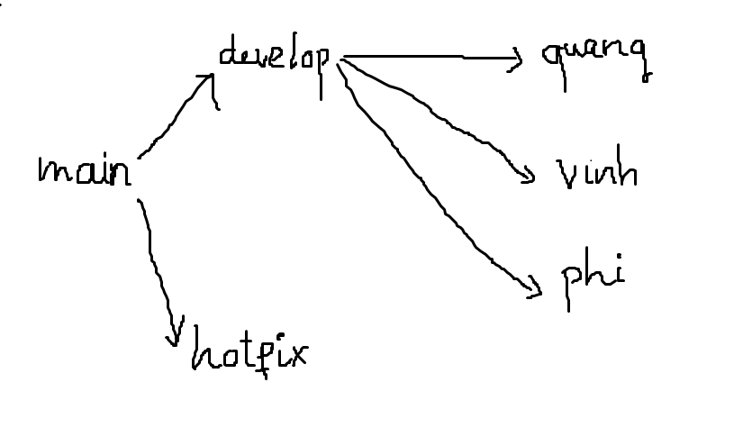

# Hotel Booking - INT3509
## Stack
### Frontend

1. Vite
2. React

### Backend

1. Spring (Spring Boot, Spring Security)
2. PostgreSQL

### Build

- Docker
- [Neon Database (Cloud Database)](https://neon.tech/)
- [Render (Cloud Application Platform)](https://render.com/)
- [Netlify (Hosting Frontend)](https://www.netlify.com/)

## Branch structure



### Explain

- **Main**: Store the code in production
- **Develop**: Store code, new develop features
- **Hotfix**: Quickly solve bugs in **Main** branch
- **Other branches**: Branch for each developer

### Flow

- Develop on **developer’s branch**
- Commit code to branch → Create **merge request** to **develop** branch
- Test in **develop** branch → Merge to **main** branch
- If have any minor bugs need to fix quickly, use **hotfix** branch

## Requirements

- Java 17
- NodeJS
- Node Package Manager (npm) or Yarn

## Installation

- Clone the repository

```jsx
git clone https://github.com/dngKwngg/Hotel_Booking.git
```

- Navigate to new created folder

```jsx
cd Hotel_Booking
```

### Frontend

- Navigate to frontend folder

```jsx
cd client
```

- Install packages

```jsx
npm i
```

- Start on localhost

```jsx
npm run dev
```

### Backend

- Navigate to backend folder

```jsx
cd server
```

- Build the project

```jsx
mvn clean install
```

- Run the project on port 8080

### Databases

- Relationship

| Table Name | Related Table | Relationship Type | Description |
| --- | --- | --- | --- |
| roles | users | One-to-Many (1-N) | A role can have multiple users, but each user has only one role. |
| users | bookings | One-to-Many (1-N) | A user can have multiple bookings, but each booking belongs to one user. |
| provinces | hotels | One-to-Many (1-N) | A province can have many hotels, but each hotel belongs to one province. |
| hotels | hotel_rooms | One-to-Many (1-N) | A hotel can have multiple rooms of different types. |
| hotels | hotel_amenities | Many-to-Many (N-N) | A hotel can have multiple amenities, and an amenity can belong to multiple hotels. |
| hotels | bookings | One-to-Many (1-N) | A hotel can have many bookings, but each booking belongs to one hotel. |
| rooms | hotel_rooms | One-to-Many (1-N) | A room type can exist in multiple hotels with different availability and pricing. |
| bookings | booking_details | One-to-Many (1-N) | A booking can have multiple booking details (rooms booked), but each booking detail belongs to one booking. |
| booking_details | rooms | Many-to-One (N-1) | Many booking details can be associated with a single room type. |
| bookings | payments | One-to-One (1-1) | Each booking has one payment record. |
| users | payments | One-to-Many (1-N) | A user can make multiple payments for different bookings. |
| users | reviews | One-to-Many (1-N) | A user can write multiple reviews, but each review belongs to one user. |
| hotels | reviews | One-to-Many (1-N) | A hotel can have multiple reviews, but each review belongs to one hotel. |